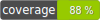

# CodeBuds TypeScript Generator Bundle

The CodeBuds TypeScript Generator Bundle is a Symfony bundle designed to improve developer experience by
automatically generating TypeScript files based on PHP files. This bundle scans your PHP entities and creates
corresponding TypeScript interfaces and types. It can also scan the PHP Enums to generate the equivalent TypeScript
Enums.

## Table of Contents

- [Installation](#installation)
- [Configuration](#configuration)
- [Usage](#usage)
    - [Types and Interfaces](#types-and-interfaces)
    - [Enums](#enums)
- [Contributing](#contributing)
- [License](#license)

## Installation

To install the bundle, use composer:

```bash
composer require codebuds/ts-generator-bundle --dev
```

## Configuration

This bundle provides three configurable parameters with default values:

- **namespace**: The PHP namespace for your entities. Default value is 'App\Entity\'.
- **interface_output_directory**: The directory where the generated TypeScript interface files will be stored. Default
  value is '%kernel.project_dir%/assets/interfaces'.
- **type_output_directory**: The directory where the generated TypeScript type files will be stored. Default value is '
  %kernel.project_dir%/assets/types'.
- **enum_output_directory**: The directory where the generated TypeScript enum files will be stored. Default value is '
  %kernel.project_dir%/assets/enums'.
- **entity_input_directory**: The directory containing the PHP files that will be used for TypeScript generation.
  Default value is '%kernel.project_dir%/src/Entity'.
- **enum_input_directory**: The directory containing the PHP enums that will be used for TypeScript enum generation.
  Default value is '%kernel.project_dir%/src/Enum'.

You can overwrite these default configurations by creating a YAML file inside your config directory:

```yaml
#config/generate_ts.yaml
generate_ts:
    namespace: 'App\CustomNamespace\'
    type_output_directory: '%kernel.project_dir%/custom/types'
    interface_output_directory: '%kernel.project_dir%/custom/interfaces'
    enum_output_directory: '%kernel.project_dir%/custom/enums'
    entity_input_directory: '%kernel.project_dir%/custom/Entity'
    enum_input_directory: '%kernel.project_dir%/custom/Enum'
```

## Usage

### Types and Interfaces

To generate TypeScript interfaces, run the following command:

```bash
php bin/console codebuds:generate-ts:interfaces --force
```

To generate TypeScript types, run the following command:

```bash
php bin/console codebuds:generate-ts:types --force
```

Here is the output when the command generates new interfaces:

```bash
Generate TypeScript Interfaces
==============================

 0/3 [░░░░░░░░░░░░░░░░░░░░░░░░░░░░]   0%     
                                                                                                                    
 [INFO] /srv/app/assets/interfaces/Sub1/SubSub1/SubSubEntity2.ts generated for /srv/app/src/Entity/Sub1/SubSub1/SubSubEntity2.php                                                       
                                                                                                                                                   
 [INFO] /srv/app/assets/interfaces/Sub2/SubEntity2.ts generated for /srv/app/src/Entity/Sub2/SubEntity2.php      
                                                                                                                 
 [INFO] /srv/app/assets/interfaces/Root.ts generated for /srv/app/src/Entity/Root.php                                                         

 3/3 [▓▓▓▓▓▓▓▓▓▓▓▓▓▓▓▓▓▓▓▓▓▓▓▓▓▓▓▓] 100%
```

If nothing changes in the output you will get

```bash
Generate TypeScript Interfaces
==============================

 0/3 [░░░░░░░░░░░░░░░░░░░░░░░░░░░░]   0% 
 
 ! [NOTE] No changes for /srv/app/assets/interfaces/Sub1/SubSub1/SubSubEntity2.ts                                       

 ! [NOTE] No changes for /srv/app/assets/interfaces/Sub2/SubEntity2.ts                                                  

 ! [NOTE] No changes for /srv/app/assets/interfaces/Root.ts     
 
 3/3 [▓▓▓▓▓▓▓▓▓▓▓▓▓▓▓▓▓▓▓▓▓▓▓▓▓▓▓▓] 100%

```

#### Options

You can overwrite the configured values for the namespace, inputDirectory and outputDirectory when running the
commande :

```bash 
codebuds:generate-ts:interfaces --namespace=App/Test/ --inputDirectory=vendor/codebuds/generate-ts-bundle/src/Tests/data --outputDirectory=vendor/codebuds/generate-ts-bundle/src/Tests/output --force
```

## Output

The script will try to match the types. If you have an entity that has relations it will map those to the TypeScript
Interfaces.

With an Entity like :

```php
<?php

namespace App\Test;

use App\Repository\RootRepository;
use App\Test\Sub1\SubEntity1;
use App\Test\Sub1\SubSub1\SubSubEntity1;
use App\Test\Sub1\SubSub1\SubSubEntity2;
use App\Test\Sub2\SubEntity2;
use DateTimeInterface;
use Doctrine\Common\Collections\Collection;
use Doctrine\DBAL\Types\Types;
use Doctrine\ORM\Mapping as ORM;

#[ORM\Entity(repositoryClass: RootRepository::class)]
class Root
{
    #[ORM\Id]
    #[ORM\GeneratedValue]
    #[ORM\Column]
    private ?int $id = null;

    #[ORM\ManyToOne]
    private ?SubSubEntity1 $subSubEntity1 = null;

    #[ORM\OneToMany(mappedBy: 'root', targetEntity: SubSubEntity2::class)]
    private Collection $subSubEntity2;

    #[ORM\ManyToMany(targetEntity: SubEntity1::class, inversedBy: 'roots')]
    private Collection $subEntity1;

    #[ORM\OneToOne(cascade: ['persist', 'remove'])]
    private ?SubEntity2 $subEntity2 = null;

    #[ORM\Column(type: Types::DATETIME_MUTABLE, nullable: true)]
    private ?DateTimeInterface $datetime = null;

    #[ORM\Column(type: Types::TEXT)]
    private ?string $text = null;
}
```

The interface output will be :

```ts
import {SubSubEntity1} from "./Sub1/SubSub1/SubSubEntity1"
import {SubSubEntity2} from "./Sub1/SubSub1/SubSubEntity2"
import {SubEntity1} from "./Sub1/SubEntity1"
import {SubEntity2} from "./Sub2/SubEntity2"

export interface Root {
  id: number;
  subSubEntity1: SubSubEntity1;
  subSubEntity2: Array<SubSubEntity2>;
  subEntity1: Array<SubEntity1>;
  subEntity2: SubEntity2;
  datetime: Date;
  text: string;
}
```

The type output will be :

```ts
import {SubSubEntity1} from "./Sub1/SubSub1/SubSubEntity1"
import {SubSubEntity2} from "./Sub1/SubSub1/SubSubEntity2"
import {SubEntity1} from "./Sub1/SubEntity1"
import {SubEntity2} from "./Sub2/SubEntity2"

export type Root = {
  id: number;
  subSubEntity1: SubSubEntity1;
  subSubEntity2: Array<SubSubEntity2>;
  subEntity1: Array<SubEntity1>;
  subEntity2: SubEntity2;
  datetime: Date;
  text: string;
}
```

### Enums

To generate TypeScript enums, run the following command:

```bash
php bin/console codebuds:generate-ts:enums --force
```

This works for simple enums :

```php
<?php

namespace App\Test\Enum;

enum NotBacked
{
    case First;
    case Second;
}
```

Turns into

```ts
export enum NotBacked {
  First,
  Second,
}
```

And for backed enums :

```php
<?php

namespace App\Test\Enum;

enum BackedString: string
{
    case String = 'String';
    case Another = 'Something';
}
```

Turns into :

```ts
export enum BackedString {
  String = "String",
  Another = "Something",
}
```

## TODO

- union types

## Contributing

If you want to contribute to this project, feel free to open issues and submit pull requests.

## License

This bundle is open-source software licensed under the [MIT license](https://opensource.org/license/mit/).
